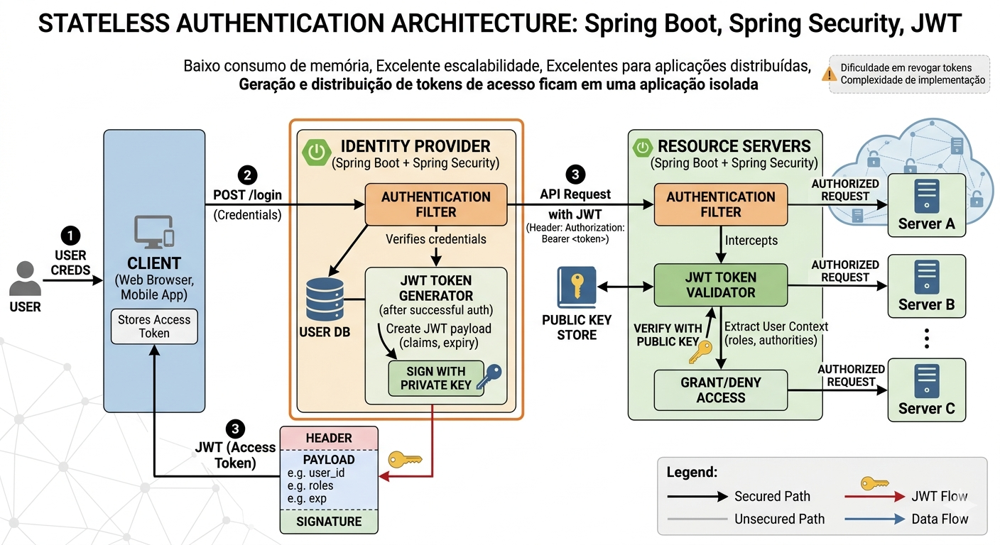

# Stateless Authentication Project

Autenticação Stateless

Consistem em uma estratégia de autenticação onde o usuário, após informar suas credenciais, recebe um token de acesso.
- Este token contém os dados necessários identificar e autorizar quem gerou o token, caso o sistema que recebe a requisicão com o token tenha a chave de acesso.
- Os dados do access token, normalmente são armazenados no lado do cliente, ou seja, no navegador ou aplicação mobile.
- O dados são assinados por um chave para garantir a integridade dos dados.

## Vantagens:

- Baixo consumo de memória
- Excelente no quesito escalabilidade
- Excelente para aplicações distribuídas
- Maior facilidade para uso em integrações com terceiros
- Geração e distribuição de tokens de acesso ficam em uma aplicação isolada

## Desvantagens:

- Menor controle de acesso
- Não é possível revogar o token com facilidade ou a qualquer momento
- Pode facilitar a entrada de terceiros mal intencionados
- Mais complexo de se implementar

## Arquitetura

## Tecnologias

- Linguagem: Java
- Frameworks: Spring Boot, Spring Security
- Dados: PostgreSQL
- Ferramentas/ORMS: JPA/Hibernate
- Infraestrutura: Docker, Docker Compose, Jenkis
- Documentação: Swagger/OpenAPI, Postman (Opcional).

## Como executar o projeto

 Há dois caminhos para executar o projeto, o primeiro usando apenas docker o segundo usando jenkins

### Excutando o projeto com apenas docker

- Execute o comando para empacotar a aplicação: mvn clean package
- Execute os comandos para realizar o build da imagem: docker build -t stateless-auth-api .
- Execute os comandos para realizar o build da imagem: docker build -t stateless-any-api .
- Execute o docker compose na raiz do repositório: docker compose up

### Executando o projeto com Jenkins

- Adicione o repositório ao jenkins de cada um dos projetos: auth-api e any-api
- Execute a pipeline
- Execute o docker compose na raiz do repositório: docker compose up